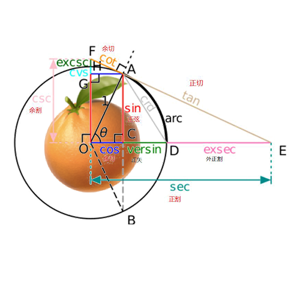

# Three-Geometry
为[image3D.js](https://hai2007.gitee.io/image3d/)设计开发的三维几何坐标运算库

<p>
  <a href="https://hai2007.gitee.io/npm-downloads?interval=7&packages=three-geometry"></a>
  <a href="https://packagephobia.now.sh/result?p=three-geometry"></a>
  <a href="https://www.npmjs.com/package/three-geometry"></a>
  <a href="https://github.com/clunch-contrib/Three-Geometry/blob/master/LICENSE"></a>
  <a href="https://github.com/clunch-contrib/Three-Geometry">
        
    </a>
</p>

## Issues
使用的时候遇到任何问题或有好的建议，请点击进入[issue](https://github.com/clunch-contrib/Three-Geometry/issues)，欢迎参与维护！

## How to use?

首先，你需要使用npm进行安装：

```
npm install --save three-geometry
```

然后就可以使用了：

```js
import ThreeGeometry from 'three-geometry';
var threeGeometry = ThreeGeometry(options);
```

通过传递一个json格式的```options```来获取一个计算实例```threeGeometry```，其上提供了各种几何体的绘制数据```data```的方法。

他们的数据格式如下：

- options

```js
{
    precision:number, // 精度，必输
}
```

- data

```js
{
    // 点数组
    points:Array<x1:number,y1:number,z1:number,x2:number,y2:number,z2:number,...>,

    // 点的个数
    length:number,

    // 字符串，表示应该使用什么方法来绘制这些点
    // 关于这些方法，你可以参考image3D.js中的文档：
    // https://hai2007.gitee.io/image3d/index.html#/api?fixed=painter
    methods:Triangle|StripTriangle|FanTriangle,
}
```

## List of Geometry

下面，我们来列举一下具体的几何体有哪些。

### 圆柱体(cylinder)

```js
// 底部坐标（x,y,z)、半径radius、高height
threeGeometry.cylinder(function(data){
    // todo
},x,y,z,radius,height);
```

### 棱柱体(prism)

```js
// 底部坐标（x,y,z)、半径radius、高height、棱的个数num
var data = threeGeometry.prism(function(data){
    // todo
},x,y,z,radius,height,num);
```

需要注意的是，为了方便计算，默认我们统一是把物体看成平放在xoz平面上。

开源协议
---------------------------------------
[MIT](https://github.com/clunch-contrib/Three-Geometry/blob/master/LICENSE)

Copyright (c) 2021 [hai2007](https://hai2007.gitee.io/sweethome/) 走一步，再走一步。
