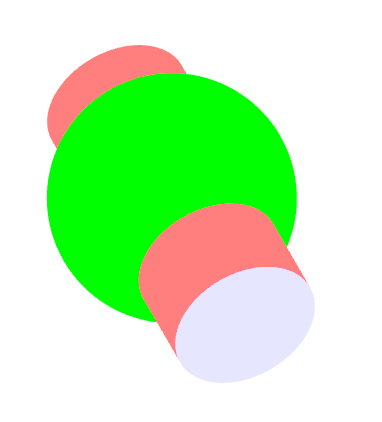

# Three-Geometry
为[image3D.js](https://hai2007.gitee.io/image3d/)设计开发的三维几何坐标运算库

<p>
  <a href="https://hai2007.gitee.io/npm-downloads?interval=7&packages=three-geometry"></a>
  <a href="https://packagephobia.now.sh/result?p=three-geometry"></a>
  <a href="https://www.npmjs.com/package/three-geometry"></a>
  <a href="https://github.com/clunch-contrib/Three-Geometry/blob/master/LICENSE"></a>
  <a href="https://github.com/clunch-contrib/Three-Geometry">
        
    </a>
</p>



## Issues
使用的时候遇到任何问题或有好的建议，请点击进入[issue](https://github.com/clunch-contrib/Three-Geometry/issues)，欢迎参与维护！

## 如何使用？

首先，你需要使用npm进行安装：

```
npm install --save three-geometry
```

然后，就可以引入自己需要的图形计算接口（我们这里以圆为例）：

```js
import circle from 'three-geometry/circle.js';
var data=circle(20, 0, 0, 0, 200);
```

返回的data应该是一个数组，数据格式如下：

```js
[{
    {
        num: number,// 点的个数
        points: Array<number>,// 点坐标
        link: null, //如果是null，表示不采用索引，否则点采用索引
        graph: "FanTriangle"// 表示这些点应该采用画笔方法绘制
    }
},...]
```

返回的数组的每个条目格式都一样，只需要一个个把每个条目绘制一下，就可以呈现出最终的效果。

字段```graph```可选的绘制方法如下：

- Triangle：三角形
- StripTriangle：共边三角形
- FanTriangle：旋转围绕三角形

如果上面的说明你无法很好的理解，你可以参考image3D中[关于画笔方法](https://hai2007.gitee.io/image3d/index.html#/api?fixed=painter)一节中的说明（虽然本项目只是单纯计算，不过，由于初衷是为[image3D.js](https://hai2007.gitee.io/image3d/)服务的，因此很多设计上和其是一脉相通的）。

此外，还有两点需要注意：

> 【1】为了方便计算，默认我们统一是把物体看成平放在```xoz```平面上。

> 【2】下面所有方法参数中出现的precision都表示精度，精度的大小决定了图形的清晰程度，适当即可。

### 可用图形

下面，我们来列举出所有可用接口。

- 圆（circle）

```js
import circle from 'three-geometry/circle.js';

/**
 * @param {number} precision 精度
 * @param {number} cx 圆心X坐标
 * @param {number} cy 圆心Y坐标
 * @param {number} cz 圆心Z坐标
 * @param {number} radius 圆半径
 */
var data=circle(precision, cx, cy, cz, radius);
```

开源协议
---------------------------------------
[MIT](https://github.com/clunch-contrib/Three-Geometry/blob/master/LICENSE)

Copyright (c) 2021 [hai2007](https://hai2007.gitee.io/sweethome/) 走一步，再走一步。
